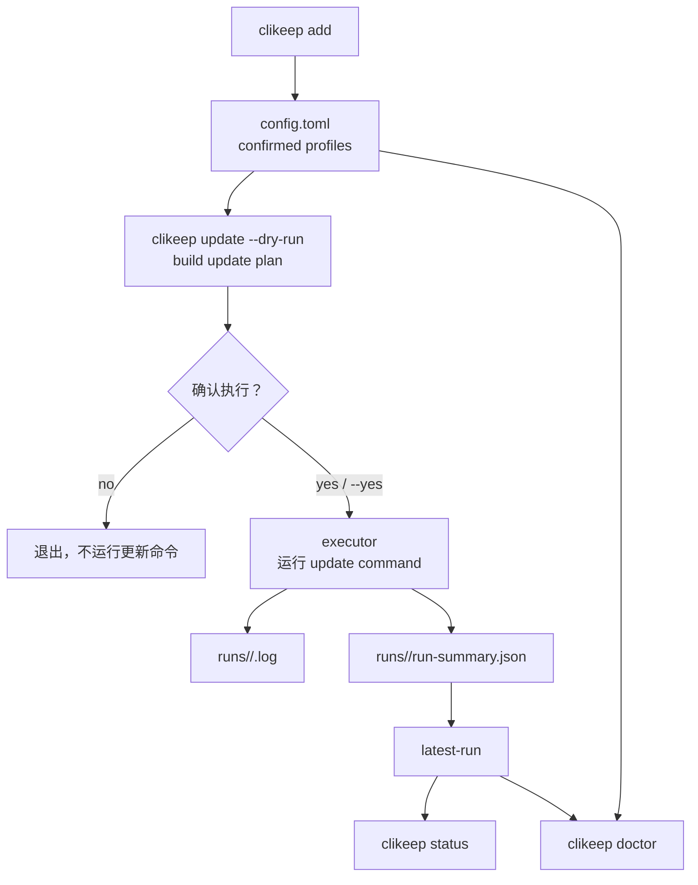

# Clikeep：本地优先的 CLI 更新管理器

> **Clikeep 是一个 local-first update manager for CLI tools you already trust**
>
> 用来把已经确认过、平时会手动执行的 CLI 更新命令收敛到一个本地入口：先看计划，再确认执行，失败后能查日志
>
> 它不替代 Homebrew、npm、pip、cargo 这类包管理器，也不自动扫描本机所有工具。当前 v0.1 Preview 的重点是把“可信更新命令”管理得更清楚、更可复查

## 💡 概览

Clikeep 适合解决的问题很简单：

- 本地装了很多 CLI，每个工具都有自己的更新入口
- 有些 CLI 是内部工具或自更新工具，不能完全交给一个通用包管理器处理
- 手动维护一堆命令容易忘，也不方便排查上次更新是否成功

Clikeep 把这些更新入口收敛成一个本地 profile：

- 每个 profile 只保存一个已确认的更新命令
- 更新前可以 `dry-run` 看执行计划
- 执行时按 profile 跑命令，默认交互确认
- 每个工具都有独立日志，失败后能回到现场
- `status` 和 `doctor` 用来查看最近结果和本地配置状态

当前版本刻意保持克制：不做自动发现，不接管包源，不执行复杂 shell 脚本，也不替用户判断远端是否有新版本。

## 🧩 当前包含哪些能力

| 能力 | 适合做什么 | 关键边界 |
|---|---|---|
| `init` | 创建本地配置和状态目录 | 不写示例 profile，避免把示例误当成已确认命令 |
| `add` | 新增一个确认过的 CLI 更新 profile | 交互终端会要求确认；非交互环境需要 `--yes` |
| `list` | 查看当前配置了哪些 profile | 只展示 config 中的 profile，不读取历史运行 |
| `update` / `up` | 执行一个或多个 profile 的更新命令 | 默认需要确认；脚本或 CI 中需要 `--yes` |
| `update --dry-run` | 预览更新计划 | 不执行 update command，也不会生成 run log |
| `status` | 查看 profile 最近一次运行状态 | 只读 latest run summary，不扫描所有历史记录 |
| `doctor` | 检查配置、命令路径和最近运行状态 | 不检查远端是否有新版本 |
| `self-update` | 更新 Clikeep 自身 | 和 `clikeep update` 分开，避免混淆被管理工具和 Clikeep 本体 |

## 🚀 Quick Start

### 安装

```bash
go install github.com/catwithtudou/clikeep/cmd/clikeep@latest
```

安装指定版本：

```bash
go install github.com/catwithtudou/clikeep/cmd/clikeep@v0.1.0
```

### 初始化

```bash
clikeep init
```

默认路径：

| 类型 | 默认路径 |
|---|---|
| config | `~/.config/clikeep/config.toml` |
| state | `~/.local/state/clikeep` |
| runs | `~/.local/state/clikeep/runs/<run-id>/` |

### 添加 profile

```bash
clikeep add gh-extensions \
  --update "gh extension upgrade --all" \
  --yes

clikeep add rustup \
  --update "rustup update" \
  --version "rustup --version" \
  --yes

clikeep add team-cli \
  --update "team-cli self update" \
  --version "team-cli --version" \
  --yes
```

这些命令只是示例。保存 profile 前，先用对应工具自己的 `--help` 或官方文档确认真实更新入口。

### 预览与执行

```bash
clikeep update --dry-run
clikeep update rustup --dry-run

clikeep update
clikeep update rustup
clikeep update --yes
```

默认会并发执行本次计划里的 eligible profiles。需要限制并发度时使用：

```bash
clikeep update --jobs 3 --yes
```

并发只适合彼此独立、不会争抢同一安装目录或包管理器锁的工具。对内部 CLI、自更新器或会改写共享环境的工具，使用 `--sequential` 或 `--jobs 1`：

```bash
clikeep update --sequential --yes
```

### 查看结果

```bash
clikeep status
clikeep status rustup
clikeep doctor
```

失败时先看 `status` 里的 log path，再打开对应 profile log。日志里会保留 command、status、exit code、stdout 和 stderr。

### 更新 Clikeep 自身

```bash
clikeep self-update
clikeep self-update --dry-run
clikeep self-update --version v0.1.0
```

`clikeep update` 更新的是被管理的 profile，不更新 Clikeep 自己。

## 🧱 底层架构设计

Clikeep 的模型分成两层：

- config 保存用户意图：管理哪些 CLI、更新命令是什么、是否 confirmed、是否 enabled
- state 保存运行证据：最近一次 run id、每个工具的结果、日志路径、stdout / stderr



这个分层让 config 保持稳定、可读、可迁移，同时让每次运行产生的证据留在 state 中。日常更新不会把 config 变成流水账。

## 🔗 项目地址

```text
https://github.com/catwithtudou/clikeep
```
