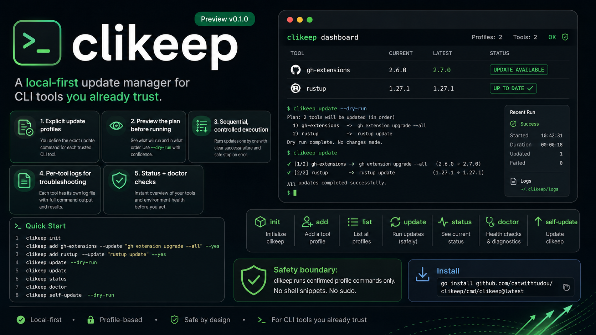
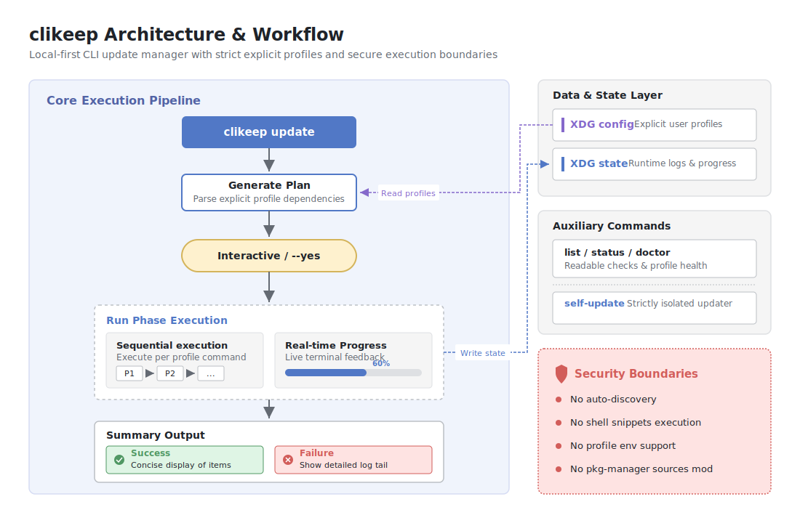

# clikeep

clikeep is a local-first update manager for CLI tools you already trust.



Conceptual overview. The exact commands, paths, and safety boundaries are
documented below.

## Status

`v0.1.0` is a Preview release. It is intended to be usable for explicit,
profile-based local CLI updates, while keeping the scope deliberately small.

Preview v0.1 focuses on this workflow:

- keep named update profiles in one local config file
- preview the update plan before running it
- run update commands concurrently by default
- keep per-tool logs for troubleshooting
- report latest status and basic doctor checks

It does not try to replace a package manager, discover tools automatically, or
manage package-manager sources.

## Prerequisites

clikeep is installed with the Go toolchain. Make sure `go` is available before
installing:

```bash
go version
```

This repository currently targets Go `1.24.7`, as declared in `go.mod`.
`go install` writes the binary to `$GOBIN`, or to `$GOPATH/bin` when `GOBIN` is
not set. Make sure that directory is on your `PATH`.

## Install

```bash
go install github.com/catwithtudou/clikeep/cmd/clikeep@latest
```

For a specific release:

```bash
go install github.com/catwithtudou/clikeep/cmd/clikeep@v0.1.0
```

Preview releases are not a stable API promise. Profile config and command
behavior are intended to stay compatible where practical.

## Use With Agent Skills

Install the Clikeep agent skill from this repository:

```bash
npx -y skills@latest add catwithtudou/clikeep
```

After the skill is installed, you can ask an agent to inspect profiles, preview
updates, run confirmed updates, and triage failures through clikeep. On first
use, the skill checks whether the `clikeep` CLI is available. If it is missing,
the agent can install it with Go after one explicit confirmation:

```bash
go install github.com/catwithtudou/clikeep/cmd/clikeep@latest
```

The skill does not silently install local binaries, edit shell startup files, or
guess update commands for tools. It uses `clikeep update --dry-run` as the safe
first move before real updates.

## Quick Start

```bash
clikeep init
clikeep add gh-extensions --update "gh extension upgrade --all" --yes
clikeep add rustup --update "rustup update" --yes
clikeep update --dry-run
clikeep update
clikeep status
clikeep doctor
clikeep self-update --dry-run
```

`clikeep update` is the primary command. `clikeep up` is kept as a short alias.

In an interactive terminal, `clikeep update` prompts before running commands. In
non-interactive environments, pass `--yes`:

```bash
clikeep update --yes
clikeep update --yes --jobs 3
clikeep update --yes --sequential
```

## Commands

| Command | Purpose |
|---|---|
| `clikeep init` | Create local config and state directories. |
| `clikeep add <name> --update "<command args>" [--version "<command args>"] [--yes]` | Add a confirmed update profile. |
| `clikeep list` | Show configured profiles in a readable table. |
| `clikeep update [profile...] [--dry-run] [--yes] [--fail-fast] [--jobs <n>] [--sequential] [--json] [--no-color]` | Plan and run profile update commands. |
| `clikeep up` | Short alias for `clikeep update`. |
| `clikeep status [profile]` | Show latest known run status for profiles. |
| `clikeep doctor` | Check config, command paths, and latest run state. |
| `clikeep self-update [--version <version>] [--dry-run] [--yes]` | Upgrade clikeep itself via `go install`. |
| `clikeep version` / `clikeep --version` | Print the clikeep version. |
| `clikeep help [command]` | Show general or command-specific help. |

## Config And State

clikeep follows XDG paths:

- config: `$XDG_CONFIG_HOME/clikeep/config.toml`, or `~/.config/clikeep/config.toml`
- state: `$XDG_STATE_HOME/clikeep`, or `~/.local/state/clikeep`
- logs: `<state>/runs/<run-id>/<profile>.log`

Profiles are explicit. clikeep does not auto-discover tools, infer update
commands, run through a shell, or support per-profile environment variables in
Preview v0.1.

## Output

Text output uses restrained ANSI color when stdout is a TTY. Color is disabled
automatically for non-TTY output, JSON output, `NO_COLOR`, and `--no-color`.

```bash
NO_COLOR=1 clikeep update --dry-run
clikeep update --json --yes
```

Successful update summaries stay concise. Failure summaries include the log path
and a short tail so the terminal has enough context without forcing you to open a
summary file.

`clikeep update` runs eligible profile update commands concurrently by default.
Use `--jobs <n>` to cap concurrency, or `--jobs 1` / `--sequential` when a
toolchain needs serialized updates.

Text output is staged for concurrent runs: plan, run mode, status lines, then a
concise summary in plan order. Command stdout and stderr are captured in
per-profile logs; failed summaries include the log path and a short tail.

With `--fail-fast`, automatic concurrency falls back to sequential execution so
the first failure can stop later profiles. When `--fail-fast` is combined with an
explicit `--jobs <n>`, commands already running are allowed to finish, and
profiles that have not started are marked as skipped after the first failure.

## Updating clikeep

`clikeep update` updates the profiles you manage with clikeep. It does not update
clikeep itself.

To upgrade clikeep, use:

```bash
clikeep self-update
```

This runs:

```bash
go install github.com/catwithtudou/clikeep/cmd/clikeep@latest
```

Use `clikeep self-update --version v0.1.0` for a specific tag. In
non-interactive environments, pass `--yes`.

`clikeep version` uses the Go module version for binaries installed with
`go install ...@<version>`. Local development builds may show `dev` or a Go VCS
pseudo-version; custom release builds can still inject a fixed label with
`-ldflags "-X main.version=v0.1.0"`.

## Safety Boundary

clikeep runs the command and arguments stored in each confirmed profile. It does
not run shell snippets, does not use `sudo`, and does not mutate package-manager
sources. Add only commands you would be comfortable running directly.

## Architecture Reference

For readers who want to understand the local client workflow, the diagram below
shows how profile config, planning, execution, status, logs, and self-update fit
together.



## Release Checklist

For a Preview v0.1 release:

```bash
gofmt -w cmd internal
python3 scripts/validate_skills.py skills
npx -y --registry=https://registry.npmjs.org skills@latest add ./ --list
go test ./...
go vet ./...
git ls-files docs CONTEXT.md clikeep_cli_update_manager_proposal.md
```

After the public branch is clean, tag `v0.1.0` and create a GitHub Release with
notes that clearly mark it as a Preview.
